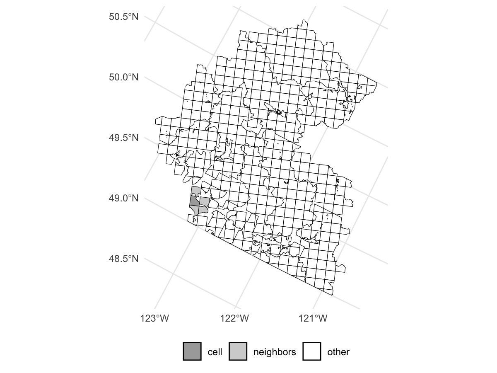
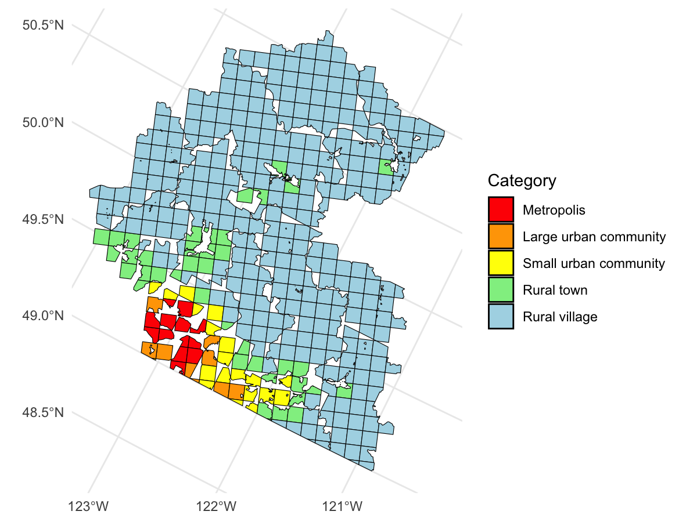
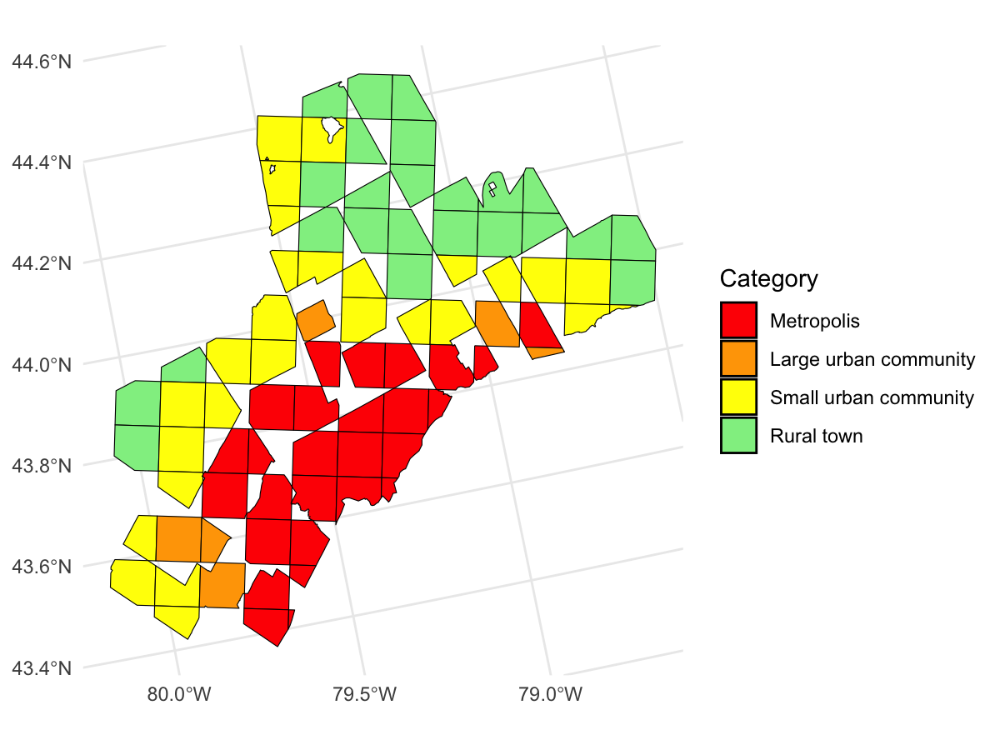

# 🧭 Community Size Classification

This repository provides a general-purpose tool to classify geographic grid cells into **community size categories** — such as *Metropolis*, *Large urban community*, *Small urban community*, *Rural town*, or *Rural village* — based on **local population density**.

It was developed to address limitations in existing classification methods that rely on administrative boundaries (i.e., census divisions, census tracks), which often fail to reflect how people are spatially distributed in real life.

---

### 🌍 General Applicability

This classifier is **designed to work with any country or context**, as long as population data is available in a regular gridded format (e.g., 10km x 10km cells).

It can be used with:

- National statistical grids (e.g., Canada, U.S.)
- Global datasets (e.g., WorldPop, GHSL)
- Urban planning, migration, or decision-support tools

---

### 🧮 Classification Method

<table>
  <tr>
    <td>
      
For each grid cell, we compute a <strong>local population density</strong>:

      $$
      \text{Local population density} = \frac{Population_{cell} + Population_{neighbors}}{Area_{cell} + Area_{neighbors}}
      $$

      
Where:

      <ul>
        <li><code>Populationcell</code> is the population in the grid cell</li>
        <li><code>Populationneighbors</code> is the population in all neighboring cells that share an edge or corner</li>
        <li><code>Areacell</code> is the area of the grid cell</li>
        <li><code>Areaneighbors</code> is the total area of all neighboring cells</li>
      </ul>
    </td>
    <td>
      
    </td>
  </tr>
</table>
 

Each grid cell is then classified using the following thresholds:

| Category                  | Local Density (people/km²)  | Typical Population (Canada)  |
|:-------------------------:|:---------------------------:|:----------------------------:|
| `Metropolis`              | ≥ 1000                      | > 500,000                    |
| `Large urban community`   | 500–999                     | ~100,000                     |
| `Small urban community`   | 100–499                     | ~50,000                      |
| `Rural town`              | 10–99                       | ~10,000                      |
| `Rural village`           | < 10                        | < 5,000                      |

💡 **Tip:** You can customize these thresholds to fit your specific context.

In some cases, we manually reclassify specific grid cells to better reflect known local realities. These manual overrides improve classification quality for edge cases.

---

### 📊 Example Output

Here's a visual preview of what the classification looks like when applied to a 10km × 10km gridded population dataset in Canada:

|  |  |
|----------------------------------------------|--------------------------------------------|
| *Lower-Mainland Southwest economic region (British Columbia)* | *Toronto economic region* |

---

###  ▶️  Run the Example

You can reproduce this output using the included script:

📄 [`code/example_classify.R`](code/example_classify.R)

This script:

- Loads a Canadian gridded population dataset from `data/`
- Computes local densities for each cell
- Classifies each cell using the defined thresholds
- Visualizes the output for specific regions in Canada

---

### 🤝 Contributing

Contributions welcome! You can:

- Add support for new geographies
- Propose new classification thresholds
- Suggest improvements or extensions

Please open an issue or submit a pull request.

---

### 🧩 Credits

Developed by Amor Ai, in collaboration with the [GeoMatch team](https://immigrationlab.org/geomatch/) ([Immigration Policy Lab](https://immigrationlab.org/))

---
